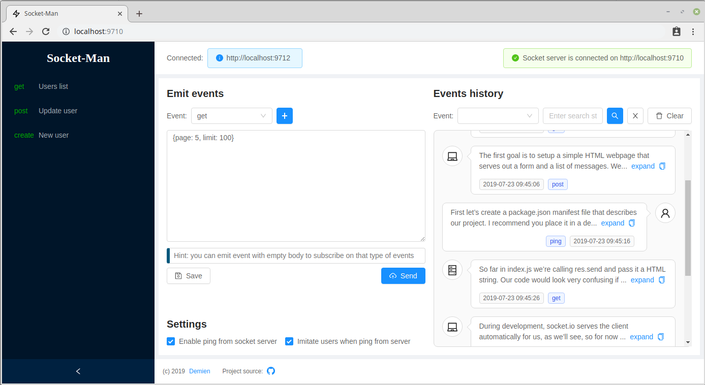
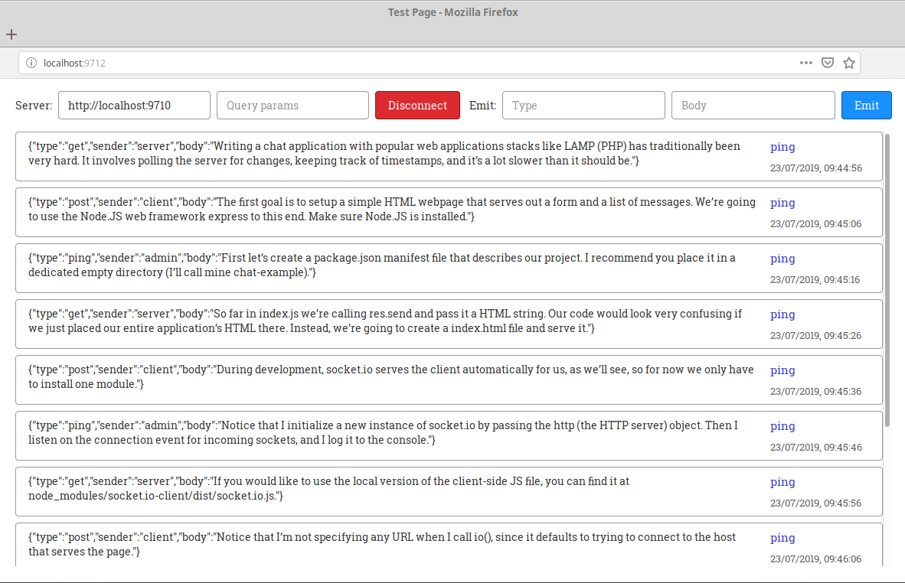

## Socket-Man
A tool for simple testing your socket client via using simple Socket.io server

### Screenshots
There are screenshots of main page of **Socket-Man** and special test page which was used
during development:<br><br>
<br><br>
<br>

### Why
Let's assume we develop a front-end application that uses socket connections.
But at the moment we don't have access to server or can't emit events from it to client.<br>
So, how can we imitate incoming socket events for testing purposes?<br>
This is why given tool was created.

### Features
With **Socket-Man** you can:
- send events from server to client via convenient admin shell
- subscribe on any event that client can emit to server
- look over all events with their data and possibility to simply copy content
- save your events for further using

### Using via Docker
The image is available on [Docker Hub](https://cloud.docker.com/repository/registry-1.docker.io/daminort/socket-man), so you can just type:

```shell
$ docker run -p 9710:9710 daminort/socket-man
```
The Admin-shell will be available on [localhost:9710](http://localhost:9710)

> Note. You can choose any port you like as well, for example, `7777`:
> ```shell
> docker run -p 9710:7777 daminort/socket-man
> ``` 

### Using via Docker-Compose
In this case you need to clone repository:

```shell
$ git clone https://github.com/daminort/socket-man.git
$ cd socket-man
$ docker-compose up --build
```

> Note. You can use instead of latter command npm-script:
> ```shell
> npm run compose-up
> ``` 

### Using via Source
In this case you need to start server and client manually and separately.
`Server` will be listening port `9710` meanwhile `Client` will start on port `9711`.  
Also you can start test page which demonstrate working example. 
```shell
$ git clone https://github.com/daminort/socket-man.git
$ cd socket-man

$ cd server
$ npm start

$ cd client
$ npm start

$ cd test
$ npm start
```

> Note. You can change server port by editing `.env` files:<br>
> server/.env, variable `APP_PORT`<br>
> client/.env.local, variable `REACT_APP_SOCKET_SERVER_PORT`<br>
> 
> For changing client port you need to edit script `start` in `package.json`:<br>
> `"start": "PORT=9711 react-scripts start"`

### License
<a name="license"></a>

[MIT](/LICENSE) © [Daminort](https://github.com/daminort)
